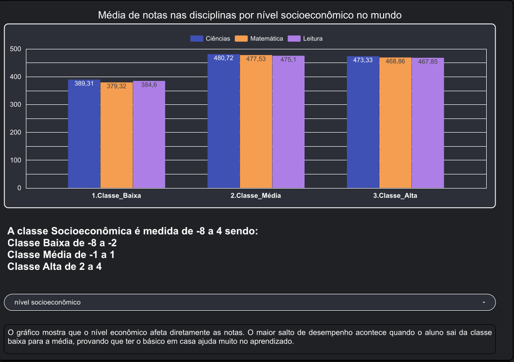
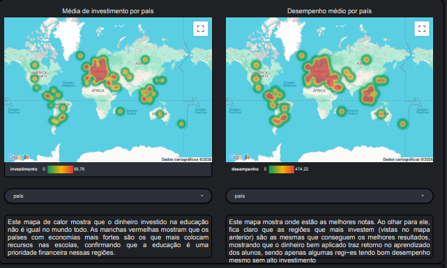
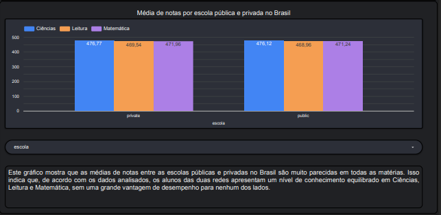

# Análise de Desempenho Educacional com Dados do PISA

Projeto de análise de dados desenvolvido utilizando SQL, Google BigQuery e Looker Studio com foco na compreensão dos impactos de fatores socioeconômicos e investimentos educacionais no desempenho dos estudantes no Brasil e no mundo.

---

## Objetivo

O projeto busca responder à seguinte questão:

> Como fatores socioeconômicos e investimentos educacionais influenciam o desempenho dos estudantes no PISA?

---

## Tecnologias Utilizadas

- SQL
- Google BigQuery
- Google Looker Studio
- Base dos Dados
- Git e GitHub

---

## Base de Dados

Os dados utilizados neste projeto foram obtidos através das seguintes fontes:

### PISA - Programme for International Student Assessment

https://basedosdados.org/dataset/781c06ad-14ac-4233-9250-f6fc6f31eafc?table=311688fc-8a57-4985-89a9-96c5d85e0fb0

### Country Codes Dataset

https://console.cloud.google.com/marketplace/product/bigquery-public-data/country-codes

Os dados foram consultados diretamente no Google BigQuery.

Devido ao grande volume do dataset, os dados completos não foram armazenados neste repositório.

---

## Estrutura das Tabelas

### student_summary

Contém informações relacionadas aos estudantes:

- Notas em matemática
- Notas em leitura
- Notas em ciências
- Índice socioeconômico
- Identificador da escola

### school_summary

Contém informações relacionadas às escolas:

- Tipo da escola
- Investimento governamental
- Ano
- País

### country_codes

Tabela de apoio utilizada para:

- Nome dos países
- Código ISO internacional

---

## Análises Realizadas

### Relação entre nível socioeconômico e desempenho

Análise do impacto do contexto socioeconômico no desempenho dos estudantes nas disciplinas avaliadas pelo PISA.

### Investimento e desempenho por país

Comparação entre investimento educacional e desempenho médio dos estudantes ao redor do mundo.

### Evolução do Brasil ao longo do tempo

Análise temporal dos investimentos educacionais e desempenho médio dos estudantes brasileiros.

### Comparação entre escolas públicas e privadas

Avaliação das médias de desempenho entre escolas públicas e privadas no Brasil.

---

## Principais Insights

- O nível socioeconômico possui forte influência no desempenho educacional.
- Países com maior investimento tendem a apresentar melhores resultados.
- O aumento do investimento no Brasil não gerou crescimento proporcional no desempenho.
- Escolas públicas e privadas apresentaram médias relativamente próximas nos dados analisados.

---

## Dashboard Interativo

O dashboard foi desenvolvido utilizando o Google Looker Studio.

Acesse:

https://datastudio.google.com/reporting/99b7bd14-71f5-464a-85c7-fde33c96104d

---

## Dashboard

## Autor

Marcos Júnio Rodrigues Sena e Tulio Rodrigues Silva